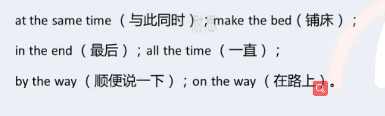

# 英语语法框架

## 10种词性

### 1.noun(名词)

> 这个东西叫什么 
>
> 缩写是:  n.
>
> 常见名词: apple、cat、china

### 2.pronoun(代词)

> 代替名词或名词性短语的词
>
> 缩写是:  pron.
>
> 常见的代词：we、that、all、who

### 3.numberal(数词)

> 表示数量、数字
>
> 缩写是: num.
>
> 常见的数词：one、ten、fifty、hundred

### 4.article(冠词) 

> 夹在名词或者名词词组前后的 a、an、the
>
> 缩写是:  art.

#### 4.1定冠词

1. 表特指的人或事物

   ==The== man with a flower in his hand is Jack.

   手上拿着一朵花的男人是杰克。

2. 复述前面提到过的人或事物

   There is a man under the tree. ==The== man is called Jack.

3. 表独一无二的事物

   The earth turns around ==the== sun.

4. 用在表示方位的名词前面

   There will be strong wind to ==the== south of ht Yangtze River.

   长江以南地区将会刮大风。

5. 在==序数词==和==形容词最高级==的前面

   Who is ==the== first one to go?

   谁第一个去？

   Of all ==the== stars ,==the== sun is ==the== nearest to ==the== earth. 

   在所有的恒星之中太阳离地球最近。

6. 用在江河、海洋、山脉等名称的前面

   I hava never been to ==the== Himalaya Mountains.

   我从来没有去过喜马拉雅山。

   ==时态=》hava never been: 现在完成时==

7. 用在含有普通名词和专有名词的前面

   He is from ==the== United States of America.

   它来自美利坚合众国。

8. 用在姓氏之前 表示一家人

   ==The== Greens are going to Mount Emei next month.

   下个月格林一家人要去峨眉山

9. 固定短语

   

10. 乐器名称之前

    He began to play ==the== violin at the age of 5.

    五岁时他开始拉小提琴

#### 4.2不定冠词

> ==总原则==
>
> 1. 不定冠词a/an用在单数名词的前面
>
> 2. a用在辅音开头的词前面
>
> 3. an用在元音开头的词的前面
>
>    元音：a e i o u开头 比如：an apple、an hour

1. 泛指某一个人或物

   There is  ==a== dog lying on the ground.

   有一只狗躺在地上。

2. 表某类人或物，区别于其他种类

   ==An== elephant is much stronger then ==a== man.

   大象比人强壮多了。

3. 表“一”这个数量

   There is ==a== table and four chairs in that dining-room.

   在那个餐厅里有一张桌子和四把椅子

4. 用不定冠词的习语

   

#### 4.3零冠词

1. ==专有名词==和第一次使用一些==不可数名词==时 前面通常不用
2. 名词前已有指示、物主或不定代词作定语时不用

### 5.verb(动词)

> 表示动作的词
>
> 缩写是 : v.
>
> 常见的动词: get、do、play

### 6.adverb(副词)

> 修饰动词，表示动作的特征，状态等的词。
>
> 缩写是 : adv.
>
> 常见的副词: next、much、back

### 7.adjective(形容词)

> 修饰名词  把一个物品形容出来 what
>
> 缩写是 : adv.
>
> 常见的副词: good、fast、hot

### 8.preposition(介词)

> 用在句子的名词成分之前，说明该成分与句子其它成分关系的词。
>
> 缩写是 : prep.
>
> 常见的介词: at、in、on

### 9.conjunction(连词)

> 把句子或者短语 把它连起来 形成一些语法结构
>
> 缩写是 : conj.
>
> 常见的连词: and、also、but

### 10.interjection(感叹词)

> 发出感叹的词，一般用于表达情感，放在句子的前面和后面 一般和句子没有什么联系
>
> 缩写是 : int.
>
> 常见的副词: what、yum、blah

## 9种成分

1. subject(主)

   > 人 或 物

2. predicate(谓)

   > 

3. object(宾)

   > 

4. attribute(定语)

   > 

5. adverbial(状语)

   > 

6. object complement(宾补)

   > 

7. subject complement(表)

   > 

8. double object(双宾)

   > 

9. apposition(同位)

   > 

## 8种句型

简单句：

- 主+谓
- 主+谓+宾
- 主+系+表
- 主+谓+双宾
- 主+谓+宾+宾补

复合句：

- 定词性从句
- 定语从句
- 状语从句