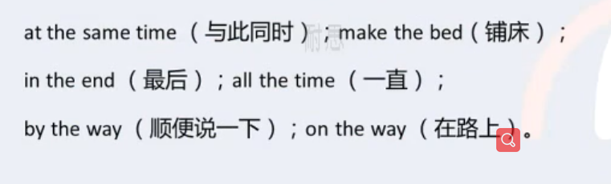
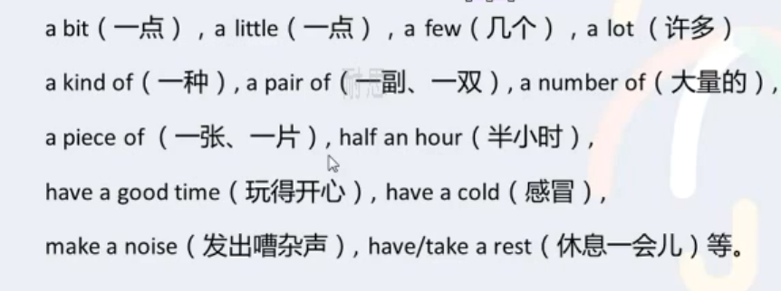
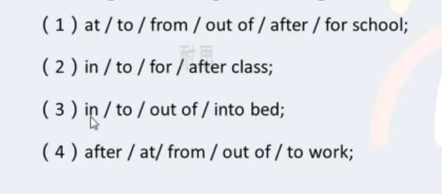
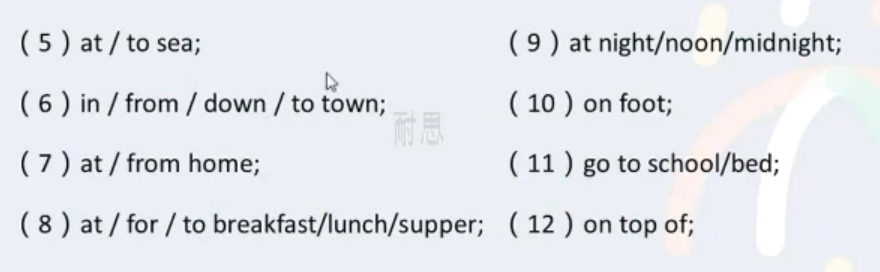
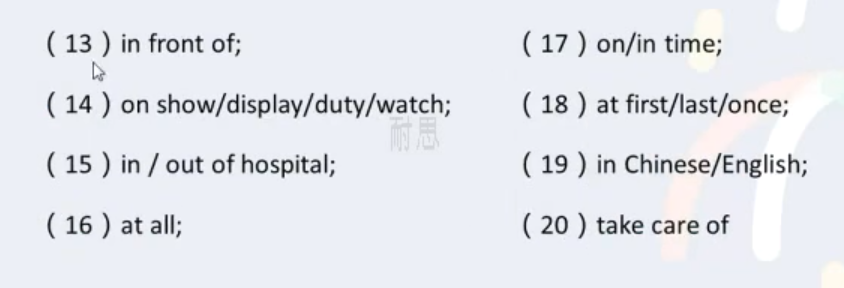

## article(冠词)  art.

> 夹在名词或者名词词组前后的 a、an、the
>
> 缩写是:  art.

### 定冠词 the

1. 表特指的人或事物

   ==The== man with a flower in his hand is Jack. （手上拿着一朵花的男人是杰克。）

2. 复述前面提到过的人或事物

   There is a man under the tree. ==The== man is called Jack.

3. 表独一无二的事物

   The earth turns around ==the== sun.

4. 用在表示方位的名词前面

   There will be strong wind to ==the== south of ht Yangtze River.（长江以南地区将会刮大风。）

5. 在==序数词==和==形容词最高级==的前面

   Who is ==the== first one to go?（谁第一个去？）

   Of all ==the== stars ,==the== sun is ==the== nearest to ==the== earth. （在所有的恒星之中太阳离地球最近。）

6. 用在江河、海洋、山脉等名称的前面

   I hava never been to ==the== Himalaya Mountains.（我从来没有去过喜马拉雅山。）

   ==时态=》hava never been: 现在完成时==

7. 用在含有普通名词和专有名词的前面

   He is from ==the== United States of America.（它来自美利坚合众国。）

8. 用在姓氏之前 表示一家人

   ==The== Greens are going to Mount Emei next month.（下个月格林一家人要去峨眉山）

9. 固定短语

   

10. 乐器名称之前

    He began to play ==the== violin at the age of 5.（五岁时他开始拉小提琴）

### 不定冠词 a / an

> ==总原则==
>
> 1. 不定冠词a/an用在单数名词的前面
>
> 2. a用在辅音开头的词前面
>
> 3. an用在元音开头的词的前面
>
>    元音：a e i o u开头 比如：an apple、an hour

1. 泛指某一个人或物

   There is  ==a== dog lying on the ground.（有一只狗躺在地上。）

2. 表某类人或物，区别于其他种类

   ==An== elephant is much stronger then ==a== man.（大象比人强壮多了。）

3. 表“一”这个数量

   There is ==a== table and four chairs in that dining-room.（在那个餐厅里有一张桌子和四把椅子）

4. 用不定冠词的习语

   

### 零冠词

1. ==专有名词==和第一次使用一些==不可数名词==时 前面通常不用

   China is a very large country.

   Man needs air and water.

2. 名词前已有指示、物主或不定代词作定语时不用

   My pen is much more expensive than yours.

   我的钢笔比你的昂贵多了。

3. 周名，月名或季节前不用

   He was born ==on Monday==，==February== 18,1995.

   他出生于1995年二月十八日，星期一

   They usually plant trees on the hills ==in spring==.

   春天他们通常在山上植树

4. (第一次使用) 复数名词表示人或事物的类别时 不用。

   Men are cleverer than monkeys.

5. 三餐饭前不用

   We hava breakfast at home and lunch at school.

6. 节假日前不用

   On Children’s Day the boys often get presents from their parents.

7. 球类名词前不用

   The children play football on Saturday afternoons.

8. 一些习惯用语中不用

   

   

   