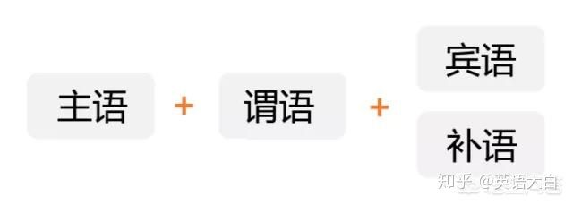
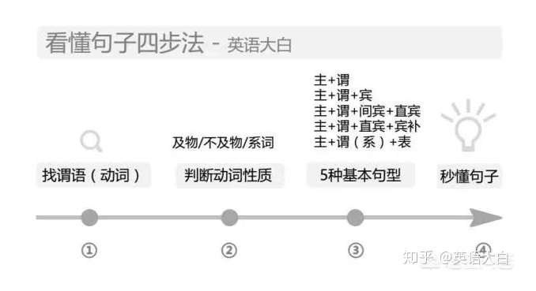
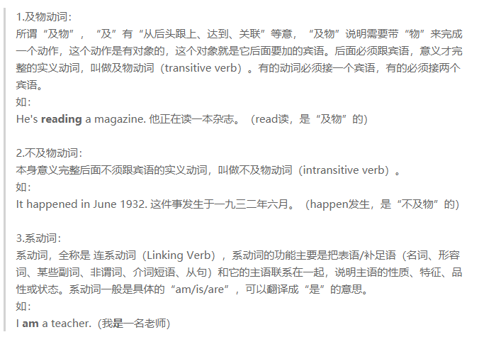
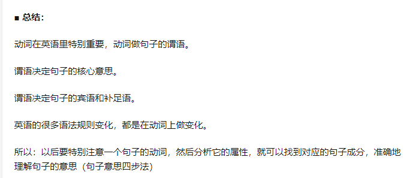

# 英语语法框架

## 10种词性

### 1.noun(名词) n.

> 这个东西叫什么 
>
> 缩写是:  n.
>
> 常见名词: apple、cat、china

### 2.pronoun(代词) pron.

> 代替名词或名词性短语的词
>
> 缩写是:  pron.
>
> 常见的代词：we、that、all、who

### 3.numberal(数词) num.

> 表示数量、数字
>
> 缩写是: num.
>
> 常见的数词：one、ten、fifty、hundred

### 4.article(冠词)  art.

> 夹在名词或者名词词组前后的 a、an、the
>
> 缩写是:  art.

### 5.verb(动词) v.

> 表示动作的词
>
> 缩写是 : v.
>
> 常见的动词: get、do、play

### 6.adverb(副词) adv.

> 修饰动词，表示动作的特征，状态等的词。
>
> 缩写是 : adv.
>
> 常见的副词: next、much、back

### 7.adjective(形容词) adj.

> 修饰名词  把一个物品形容出来 what
>
> 缩写是 : adv.
>
> 常见的副词: good、fast、hot

### 8.preposition(介词) prep.

> 用在句子的名词成分之前，说明该成分与句子其它成分关系的词。
>
> 缩写是 : prep.
>
> 常见的介词: at、in、on

### 9.conjunction(连词) conj.

> 把句子或者短语 把它连起来 形成一些语法结构
>
> 缩写是 : conj.
>
> 常见的连词: and、also、but

### 10.interjection(感叹词) int.

> 发出感叹的词，一般用于表达情感，放在句子的前面和后面 一般和句子没有什么联系
>
> 缩写是 : int.
>
> 常见的副词: what、yum、blah

## 9种成分

### 1.subject(主)

> 人 或 物

### 2.predicate(谓)

> 谓语（动词）一般谓语主语后边。找到了 谓语，也就找到了句子中的其他成分（前面是 主语，后边是 宾语、补语）

**谓语由动词充当，不同的动词属性，决定了其后面的句子成分属性：**

动词有哪些属性呢？

### 3.object(宾)

> 

### 4.attribute(定语)

> 

### 5.adverbial(状语)

> 

### 6.object complement(宾补)

> 

### 7.subject complement(表)

> 

### 8.double object(双宾)

> 

### 9.apposition(同位)

> 

## 8种句型

### 简单句：

#### 1.主+谓

#### 2.主+谓+宾

#### 3.主+系+表

#### 4.主+谓+双宾

#### 5.主+谓+宾+宾补

### 复合句：

#### 6.定词性从句

#### 7.定语从句

#### 8.状语从句

