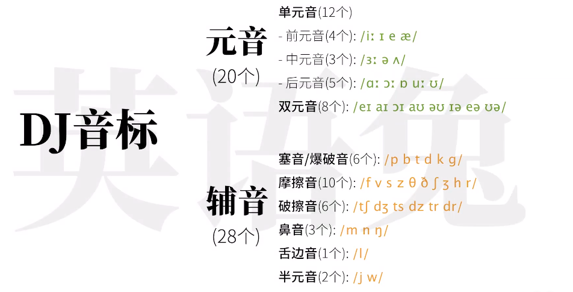

# 48个音标 20个元音 28个辅音

# 20个元音

## 12个单元音

### 4个前元音

- ### /iː/: b`ee`、 f`ee`、 p`ea`

- ###  /ɪ /: l`i`t、 h`i`t、 f`i`sh

- ### /e/ : g`e`t、 b`e`d 、p`e`t

- ### /æ/: b`a`d 、f`a`t、 p`a`t

### 3个中元音

- ###  /ɜː/: h`er`、 p`er`son、l`ear`n

- ### /ə/: `a`bout、probl`e`m 

- ### /ʌ/: b`u`t、h`u`t、m`u`st

### 5个后元音

- ### /uː/：t`oo`、f`oo`d、l`oo`se

- ### /ʊ/：b`oo`k、l`oo`k、g`oo`d

- ### /ɔː/：c`aught`、b`ought`、l`aw`

- ### /ɒ/：t`o`p、h`o`t、 l`o`t

- ### /ɑː/：f`a`st、f`a`ther、gl`a`ss

## 8个双元音

- ### /eɪ/:   m`a`ke、d`a`te、c`a`ke

- ### /aɪ/:   t`i`me、n`i`ce、b`i`ke

- ### /ɔɪ/:   b`oy`、t`oy`、v`oi`ce

- ### /aʊ/:  h`ow`、c`ow`、all`ow`

- ### /əʊ/:  h`o`pe、`o`pen、p`o`st

- ### /ɪə/:   ar`ea`、id`ea`、var`iou`s

- ### /eə/:   h`air`、p`air`、ch`air`

- ### /ʊə/:   t`our`、p`oor`、m`oor`

# 辅音

## 赛音/爆破音

## 摩擦音

## 破擦音

## 鼻音

## 舌边音

## 半元音